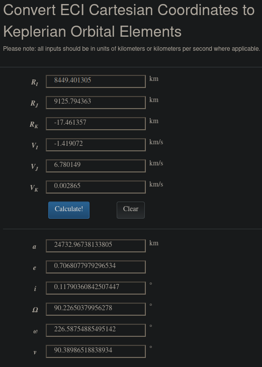

## Fiddlin' John Carson (22 points)
### Category: "Guardians of the…"

After connecting to the challenge server we are greeted with this:
```
         KEPLER        
        CHALLANGE      
       a e i Ω ω υ     
            .  .       
        ,'   ,=,  .    
      ,    /     \  .  
     .    |       | .  
    .      \     / .   
    +        '='  .    
     .          .'     
      .     . '        
         '             
Your spacecraft reports that its Cartesian ICRF position (km) and velocity (km/s) are:
Pos (km):   [8449.401305, 9125.794363, -17.461357]
Vel (km/s): [-1.419072, 6.780149, 0.002865]
Time:       2021-06-26-19:20:00.000-UTC

What is its orbit (expressed as Keplerian elements a, e, i, Ω, ω, and υ)?
Semimajor axis, a (km): 
Eccentricity, e: 
Inclination, i (deg): 
Right ascension of the ascending node, Ω (deg): 
Argument of perigee, ω (deg): 
True anomaly, υ (deg): 

That didn't work, try again!
```

So, given a position vector and velocity vector we need to find the [Keplerian elements](https://en.wikipedia.org/wiki/Orbital_elements) to describe the orbit

[This site]([https://elainecoe.github.io/orbital-mechanics-calculator/calculator.html](https://elainecoe.github.io/orbital-mechanics-calculator/calculator.html "https://elainecoe.github.io/orbital-mechanics-calculator/calculator.html") has a calculator that allows you to convert Cartesian position and velocity vectors to the respective orbital elements.



Plugging those in, we get:

```
         KEPLER        
        CHALLANGE      
       a e i Ω ω υ     
            .  .       
        ,'   ,=,  .    
      ,    /     \  .  
     .    |       | .  
    .      \     / .   
    +        '='  .    
     .          .'     
      .     . '        
         '             
Your spacecraft reports that its Cartesian ICRF position (km) and velocity (km/s) are:
Pos (km):   [8449.401305, 9125.794363, -17.461357]
Vel (km/s): [-1.419072, 6.780149, 0.002865]
Time:       2021-06-26-19:20:00.000-UTC

What is its orbit (expressed as Keplerian elements a, e, i, Ω, ω, and υ)?
Semimajor axis, a (km): 24732.96738133805
Eccentricity, e: 0.7068077979296534
Inclination, i (deg): 0.11790360842507447
Right ascension of the ascending node, Ω (deg): 90.22650379956278
Argument of perigee, ω (deg): 226.58754885495142
True anomaly, υ (deg): 90.38986518838934

You got it! Here's your flag:
```
