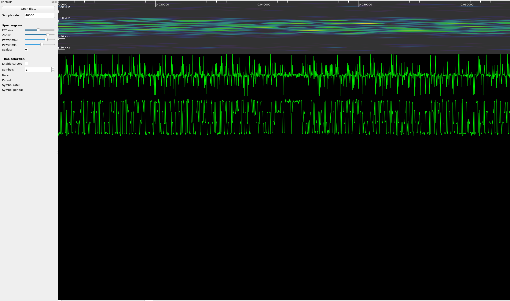
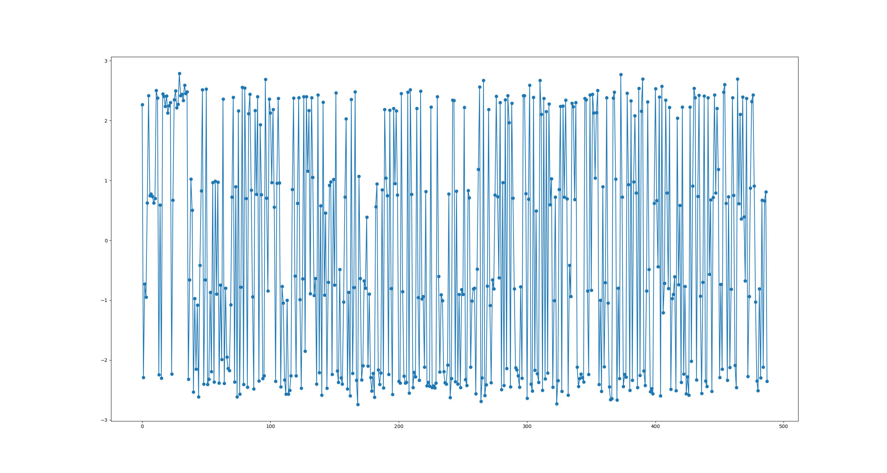

# credence clearwater space data systems

### We're On the Same Wavelength

Active ADDVulcan players:
- miek
- mossmann
- worm

## Challenge Description

We've captured this noisy IQ data from a satellite and need to decode it. Figure out how to filter the noise while maintaining the signal characteristics, then demodulate and decode the signal to get the flag. The satellite is transmitting using asynchronous markers in CCSDS space packets and an unknown modulation.

### Files

 You'll need these files to solve the challenge.

 * https://generated.2021.hackasat.com/noise/noise-delta491583sierra2.tar.bz2


### Solving

Your team's flag for this challenge will look something like:
```
flag{delta491583sierra2:___a bunch of unguessable stuff___} 
```

## Writeup by miek

After extracting the archive provided, we had a file named `iqdata.txt` which contained a list of complex numbers:

```
-0.8380148788327989+0.9014163468991035j
-0.6380851539895521+0.7598044742009349j
-0.6695787544077461+0.6410479507157362j
-0.6557559750545167+0.8182205622881492j
-0.6199799075594341-0.7203735579170356j
...
```

Most tools don't accept this file format directly, so it could be converted to binary with a simple Python script:

```python
import numpy as np

iqdata = np.loadtxt("iqdata.txt", dtype=np.complex)
iqdata.astype(np.complex64).tofile('iqdata.cf32')
```

The file could then be loaded into [inspectrum](https://github.com/miek/inspectrum) for analysis:



The screenshot above shows a spectrogram of the data, a frequency plot, and a phase plot. The phase plot looked interesting to us as it shows the phase transitioning between four distinct angles indicating that the signal was likely QPSK.

We extended the Python script to demodulate the signal and used @mossmann's [whole-packet clock-recovery](https://github.com/mossmann/clock-recovery) to recover the symbols:

```python
import numpy as np
import wpcr
import matplotlib.pyplot as plt

iqdata = np.loadtxt("iqdata.txt", dtype=np.complex)
demod = np.angle(iqdata)
syms = wpcr.wpcr(demod)
plt.plot(syms, marker="o")
plt.show()
```



Next we needed to threshold the symols and map them to bits. Thresholding limits could easily be eyeballed from the plot above but mapping symbols to bits is a little more complicated for an unknown signal. There is no standard order in which to map the angles to bit-patterns, so we simply try all the permutations:

```python
symbol_map = ['00', '01', '10', '11']
def threshold(sym, symbol_map=symbol_map):
    if sym < -1.5:
        return symbol_map[0]
    if sym < 0:
        return symbol_map[1]
    if sym < 1.5:
        return symbol_map[2]
    return symbol_map[3]

for m in permutations(symbol_map):
    tr = np.vectorize(lambda x: threshold(x, m))(syms)
    print()
    print(m)
    print("".join([chr(int("".join(x),2)) for x in tr.reshape(-1,4)]))
```

and after sifting through the output, we have the flag!

<pre>
peak frequency index: 488 / 1952
samples per symbol: 4.000000
clock cycles per sample: 0.250000
clock phase in cycles between 1st and 2nd samples: 0.750000
clock phase in cycles at 1st sample: 0.625000
symbol count: 488

('00', '01', '10', '11')
ź«Èÿü¿ÿÿ�äìàçî.--íå26�'
! 0

#<ä>,23:,îì=7ïá82ã<ç5ç61/-6.á>!àîç(


[...]

('01', '00', '10', '11')
к«Ùÿý¿ÿÿJDKMFbGEKgMçáíåãînAEllMìàvrJcQKGMaBEZVzqî\Wy\peu\AV_dCZ@K]LBãg}áT~mv_wzImîCíU|sïFLWäy^vç}LVãpã@rtWolMrnä~dåîãKáFi

<b>('01', '00', '11', '10')
�ÏüÀoflag{delta491583sierra2:GKoxYldayke_WOI3RTMRJuERiWPvh_jlQbk8tA9VCqGPDOmq3h1UBH0gbT6MSG4AbW8J8jKFTpraKs6Cv538l9g}</b>

(tA1', '11', '00', '10')                 WhIdZf`qI~	Uknt{VaXdi{TolgVJKylHhG
r}uKKydlpN]rvyM|uPT`m[Va[oEe[}TZG~PrY{|Fi
('01', '11', '10', '00')
¨zwxqvntuxdq$-!%,"b}uccq#/FNzl]xtqm~uZVJM"STISOeES}VPg|ZxQs~,dA-WBaFPDJya"|!UCL vsT'IRF$AsV,O,NGT`cqNb'Bg%",x-vi

[...]
</pre>
