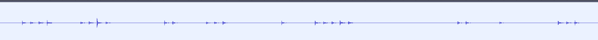

# Boots Boots

"Marching up and down again (Note: flag not in standard format)"

### Active Players

* mossmann
* haram
* coflynn

### Solve

#### Recon

Initially, *mossmann* & *haram* described hearing a very faint sound, and provided a 1m18s recording.

The description for this was changed to "moving up and down again", which did not provide any obvious clues. This was the state of the challenge for the first day.

#### Hint and Progress

Eventually, the following hint was posted:

Assuming that "flag not in standard format" meant it involved more basic codes which could not encode `{`, this hint suggested some more basic code was being referenced.

In a true masterstroke, *coflynn* took the first word he saw on the flag and entered into google along with `code`, giving the phrase `POW code`, which had the following results:

1. [Tap code - boxentriq](https://www.boxentriq.com/code-breaking/tap-code)
2. [Tap code - Wikipedia](https://en.wikipedia.org/wiki/Tap_code)
3. [The Tap Code | American Experience | Official Site](https://www.pbs.org/wgbh/americanexperience/features/honor-tap-code/)
4. [Tap Code: The True Story of Vietnam POWs and their Secret...](https://www.zondervan.com/p/tap-code-epic-survival-tale-vietnam-pow-secret-code-changed-everything/)

The first result here described the code as *The tap code is a simple way to encode messages. The messages are sent by translating letters into knock sounds.*. While the initial recording was very faint, it sounded like this could be onto something.

Unfortunately the recording quality was poor and *coflynn*'s headphones were in the other room, so instead quickly boosting the audio in audacity showed this pattern:

This sounded like great news - the tap code was described as using 1 to 5 taps. But rather than waste time understanding this, putting the sequence `4 4 2 3 1 5 2 1 3` into the [decoder](https://www.boxentriq.com/code-breaking/tap-code) resulted in the phrase `thef`. A good start - perhaps this was the beginning of the phrase `theflagis`?

### Full Flag Solve

Unfortunately, *mossmann* was at lunch and the only one able to record the hardware. This caused a less pleasant lunch experience as *coflynn* harassed him to record the full sequence, taking advantage of the fact he was 3 hours ahead in time and thus well outside of regular lunch time windows.

With a longer recording, the same advanced audio analysis technique was used to convert the recording into a longer sequence. Again using the automated tooling to ensure little true knowledge was gained, we find the flag:

