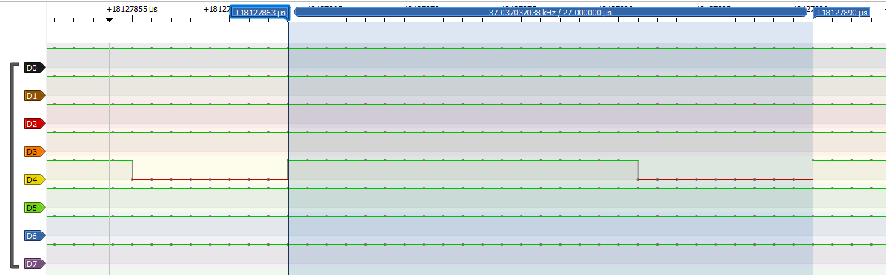
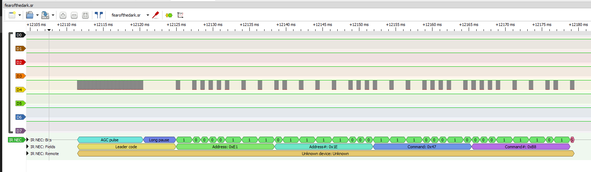

# Fear of the dark

```
I sometimes feel a little strange/ A little anxious when it's dark
dip 1010011010
```

## Active Players

* miek
* n0tty
* worm
* mossman

## Initial Observations

[fearofthedark.sr](fearofthedark.sr)

Initial analysis is similar to the lightsout challenge, we observe activity on the D4 (IR LED) on a period.



## Solution

After identifying the carrier frequency, we apply this to our NEC IR decoder (37KHz carrier freq, active low polarity) similar to the lightsout challenge.



*Miek* extracts the annotations and shares it with the team for analysis

```text
12111435-12124933 IR NEC: Fields: Leader code
12124933-12138406 IR NEC: Fields: Address: 0xE1
12138406-12151879 IR NEC: Fields: Address#: 0x1E
12151879-12165359 IR NEC: Fields: Command: 0x47
12165359-12178850 IR NEC: Fields: Command#: 0xB8
12609549-12623048 IR NEC: Fields: Leader code
12623048-12635389 IR NEC: Fields: Address: 0x49
12635389-12649993 IR NEC: Fields: Address#: 0xB6
12649993-12662360 IR NEC: Fields: Command: 0x25
12662360-12676964 IR NEC: Fields: Command#: 0xDA
[...]
```

At this stage, *NoTTY* does some analysis and nibble-swaps on the "command" of NEC IR. We noticed that each command had a specific address value. This led us to believe we needed to sort the characters based on the address location.

```python
import collections, binascii

irDict={}
for a in range(0,255):
    irDict[a]=[]
f=open("exportedAnnotationsForFear.txt","r")
addOld=0
valAsciiOld=''
for eachline in f.readlines():
    addIn=addOld
    valAscii=''
    if ("Address: " in eachline):
       addIn=(int(eachline.strip("\n").split(" ")[5],16))
    if ("Command: " in eachline):
        hexCmdB=eachline.strip("\n").split(" ")[5]
        invHexCmd=hexCmdB[:2]+hexCmdB[3]+hexCmdB[2]
        valAscii2 = chr(int(invHexCmd,16))
        fh=open('hexFile2.txt', 'ab')
        fh.write(binascii.unhexlify(invHexCmd[2:]))
f.close()
```

And we got the character set to be

```text
tRiosgdsl
or
niyN  toai ogu iontybrWeice ngxn loud4awan4e
i asyrnsnneoiela_r  lkin  YmtRbrdfuhrl ef_ce dc
dn 
aeadetaetinom  gl rndy wso_fn}hiyegrsae{wc kifatylnaanln
ofYrf3arhlou
snTmenDF fWi o gtmsrhusoeigo
d hb b dhpMhehek Osses  rksf  hdub
[...]
```

From the text and challenge name *worm* stepped in to identify lyrics from Iron Maiden's "Fear of the dark", and while we could see some part of the lyrics. At this stage, *miek* discovered the final bits to solving the problem - Nibble swapping the address value and then sorting the nibble swapped command values in the order of the nibble swapped address.

First we extract the Address and Command

```bash
$ cat fearofthedark.txt | grep '\(Address:\|Command:\)' | awk '{ print $6 }' > fear.txt
```

Now we nibble swap the Address and the Command, and sort the command based on the address

```python
def rev(b):
    return (b & 0xf) << 4 | (b >> 4)

f = open('fear.txt')
data = set()
try:
    while True:
        addr = int(f.readline(), 16)
        cmd  = int(f.readline(), 16)
        data.add((rev(addr), chr(rev(cmd))))
except:
    pass
print("".join([x[1] for x in sorted(data, key=lambda x: x[0])]))
```

And we get the solution

```bash
$ python3 fear.py
Watching horror films the night before
Debating witches and folklore
The unknown troubles on your mind
Maybe your mind is playing tricks
flag{fl4gs_R_alWaYs_N34R}
You sense and suddenly eyes fix
On dancing shadows from behind
Fear of the dark
```


