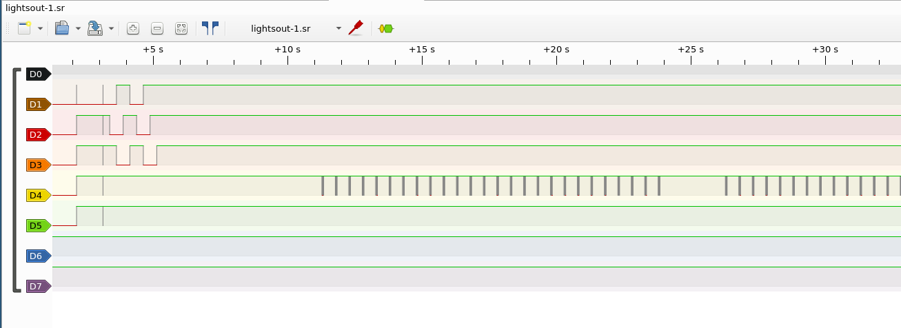
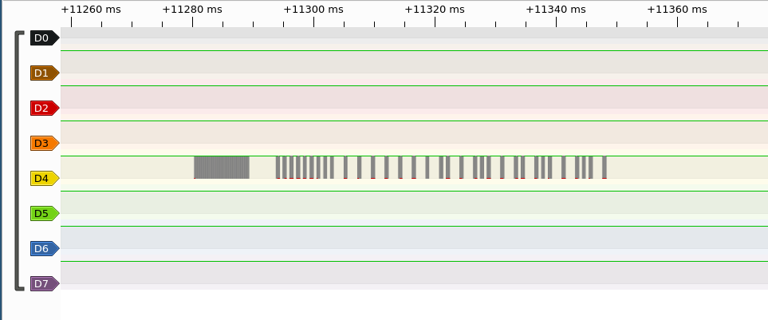
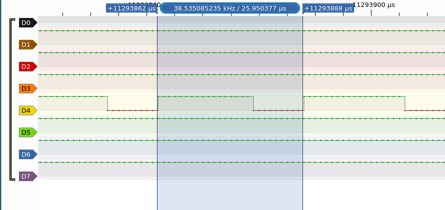
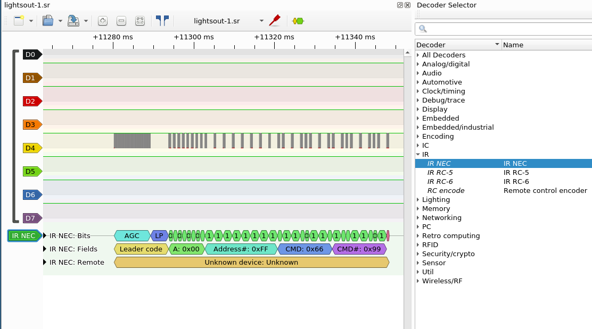

# Lights Out
```
You're not afraid of the dark, are you?

dip 1111111111
```

## Active players

 * miek
 * mossmann

## Initial observations

[lightsout.sr](lightsout.sr)

For this one, we observed activity on D4 (the IR LED) and it seemed to repeat every ~15s.



Zooming in on each pulse showed that they were made up of many smaller pulses: one large pulse at the start, then smaller pulses with varying delays between them.



Zooming in all the way showed that each pulse was made up of a ~38kHz square wave:



## Solution

The 38kHz carrier frequency is common in IR remote controls for televisions and other equipment. Given that the acitivity was on the IR LED, looking at common IR remote control protocols seemed like a good bet.

The most common is the NEC protocol, so *miek* tried out the sigrok decoder for that on the data and the results looked good!



For each decode, the address was fixed to 0x00 but the CMD field was varying. The first decode had command `0x66` which corresponds to ASCII `f`, so *miek* guessed that this may be the start of the flag.

*miek* exported all the data from PulseView (you can right click the decode output, and click "Export all annotations for this row"). That gave a text file like this:

```
11280275-11293774 IR NEC: Fields: Leader code
11293774-11302721 IR NEC: Fields: Address: 0x00
11302721-11320720 IR NEC: Fields: Address#: 0xFF
11320720-11334218 IR NEC: Fields: Command: 0x66
11334218-11347691 IR NEC: Fields: Command#: 0x99
11778363-11791862 IR NEC: Fields: Leader code
11791862-11800809 IR NEC: Fields: Address: 0x00
11800809-11818807 IR NEC: Fields: Address#: 0xFF
11818807-11832306 IR NEC: Fields: Command: 0xC6
11832306-11845778 IR NEC: Fields: Command#: 0x39
[...]
```

Then a bit of command-line work was done to get the command bytes on their own:

```
$ grep Command: lightsout.txt | awk '{ print $6 }'
0x66
0xC6
0x16
0x76
0xB7
0x26
0x33
0x47
0x47
0x56
[...]
```

Here *miek* realised that something was a bit wrong, when converted to text he got mostly garbage. Looking closer at the values, he expected the second byte to be `0x6C` (for the `l` in `flag`) but it was actually `0xC6` - the nibbles were flipped! A correction for that was added to the Python script used for decoding and it was run again, revealing the flag:

```
>>> x = open('lightsout-hex.txt').readlines()
>>> def rev(b):
...     return ((b & 0xf) << 4) | (b >> 4)
... 
>>> "".join([chr(rev(int(c,16))) for c in x])
'flag{b3tter_Luck_NEC_t1m3}flag{b3tter_Luck_NEC_t1m3}flag{b3tter_Luck_NEC_t1m3}flag{b3tter_Luck_NEC_t1m3}flag{b3tter_Luck_NEC_t1m3}flag{b3tter_Luck_NEC_t1m3}flag{b3tter_Luck_NEC_t1m3}flag{b3tter_Luck_NEC_t1m3}flag{b3tter_Luck_NEC_t1m3}flag{b3tter_Luck_NEC_t1m3}flag{b3tter_Luck_NEC_t1m3}flag{b3tter_Luck_NEC_t1m3}flag{b3tter_Luck_NEC_t1m3}flag{b3tter_Luck_NEC_t1m3}flag{b3tter_Luck_NEC_t1m3}flag{b3tter_Luck_NEC_t1m3}flag{b3tter_Luck_NEC_t1m3}flag{b3tter_Luck_NEC_t1m3}flag{b3tter_Luck_NEC_t1m3}flag{b3tter_Luck_NEC_t1'
```
