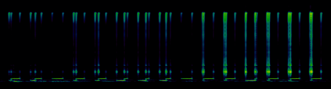

# Shut Up, Ricky!

## Challenge Description

"We got a complaint that someone is getting high and drunk playing space in the middle of the CTF. (Note: flag not in standard format)"

## Active ADDVulcan Players

- mossmann (writeup author)
- miek
- coflynn
- haram

## Initial Observations

After configuring the switches and starting up the board we observed faint clicking noises coming from the speaker. An audio recording revealed a repeating pattern.

coflynn isolated and normalized the repeating section, giving us an easier file to work with:

[repeating.wav](repeating.wav)

## Audio Analysis

Thanks to the normalization, we could hear some low tones in this file.

miek used [inspectrum](https://github.com/miek/inspectrum) to investigate and found that there were two distinct pitches (200 Hz and 400 Hz).



The clicky sounds were high frequency defects at the beginnings and ends of those tones and at the frequency transition within most of the tones. Each tone starts with some time at 200 Hz and then transitions to 400 Hz after a varying duration.

## Decoding

Measuring the timing manually, miek identified that the time periods were all multiples of 5 ms. He produced a table that shows duration in ms at 200 Hz followed by duration in ms at 400 Hz for each of the 15 tones in the repeating section:

```
25 100
55 70
0 125
30 95
40 85
90 35
90 35
75 50
0 125
10 115
20 105
110 15
20 105
20 105
15 110
```

I observed that 125 ms (the total duration of each tone) divided by the time unit of 5 ms yields an alphabet of 26 symbols, so I tried the most obvious mapping of symbols to letters and found the flag:

```python
In [6]: for n in (25, 55, 0, 30, 40, 90, 90, 75, 0, 10, 20, 110, 20, 20, 15):
   ...:     print(chr(ord('a')+n//5))
   ...: 
f
l
a
g
i
s
s
p
a
c
e
w
e
e
d
```
